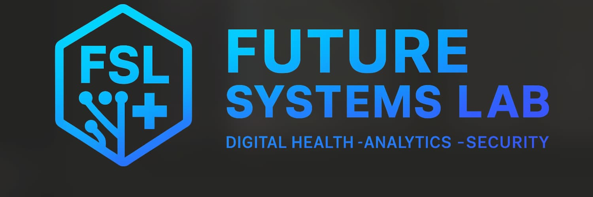

<!-- Rights Reserved, Unlicensed -->

  

---

## 🥼 About Future Systems Lab

Future Systems Lab develops **applied informatics** and **blockchain infrastructure** for healthcare.  
Evolving from wellness product design to digital health architecture, the lab advances **transparency**, **traceability**, and **trust** through decentralized identity, consent, and analytics—building **scalable**, **compliant**, and **human-centered** systems for modern care.

---

# 📌 Pinned Case Studies

**Future Systems Lab** showcases applied expertise in **digital health architecture**, **health informatics**, **Web3 product management**, **blockchain governance**, and **data transparency systems**.

---

## ⌚ NeuroBalance Watch
**Category:** Wearable Digital Health R&D  
**Focus:** On-Chain Consent • Biosensing Precursors • Orthomolecular Insight Engine

**Summary:**  
A next-generation educational wearable prototype integrating on-chain consent, amino-acid precursor biosensing (R&D), and a modular React Native watch interface.  
NeuroBalance models precursor activity for dopamine, serotonin, GABA, endorphins, and the endocannabinoid system (ECS), generating human-readable orthomolecular insights without clinical claims.

**What It Demonstrates:**  
- Smart contract architecture (Sepolia)  
- Consent governance for wearables  
- Multi-analyte electrochemical sensor R&D  
- Orthomolecular neuromodulator modeling  
- Full demo (screenshots + video)  
- A polished product flow from contract → data → UX  

**Repository:**  
https://github.com/Future-Systems-Lab/NeuroBalance-Watch

---

## 🧪 CBD Continuum Retail
**Category:** Applied Retail Systems Design  
**Focus:** Health Product Lifecycle • Consumer Data Integrity • Operations Analytics

**Summary:**  
First CBD wellness retail store in Apex, North Carolina. Demonstrated **evidence-based retail design**, **regulated-market compliance**, and **data-driven transparency** through COA verification and traceable product provenance.

**Products & COAs:**  
- Catalog (GitHub): https://github.com/Future-Systems-Lab/CBD-Continuum-Retail/tree/main/CBD-Products  
- COAs (GitHub): https://github.com/Future-Systems-Lab/CBD-Continuum-Retail/tree/main/CBD-Products/COAs

**Repository:**  
- https://github.com/Future-Systems-Lab/CBD-Continuum-Retail

---

## 🧠 Mental Wellness Ecosystem
**Category:** Digital Health Systems Architecture  
**Focus:** Blockchain Governance • Clinical Informatics • Secure Consent

**Summary:**  
Decentralized mental-wellness network integrating **behavioral science**, **clinical data governance**, and **verifiable credentials (DID/VC)** for patient consent and secure identity exchange.

**Repositories:**  
- [Where-Mental-Wellness-Meets-Metaverse](https://github.com/Future-Systems-Lab/Where-Mental-Wellness-Meets-Metaverse) — ecosystem foundation  
- [HypnoNeuro](https://github.com/Future-Systems-Lab/HypnoNeuro) — modular engagement and practitioner verification  
- [EncryptHealth](https://github.com/Future-Systems-Lab/EncryptHealth) — encrypted data and compliance analytics

---

## 🧩 HypnoNeuro Modular Framework
**Category:** Decentralized Therapeutic Design  
**Focus:** Tokenized Engagement • AI Personalization • Story-Based Reintegration

### Overview
A modular framework for applied research in:
- AI-assisted emotional processing  
- data-integrated wellness analytics  
- tokenized behavioral reinforcement (NFT credentialing)

Each module connects to **HypnoNeuro** for participation rewards and verifiable credentials, **and to EncryptHealth for medication-change verification**.

### What’s Live Now
- **L2 Orthomolecular Dashboard MVP**  
  Wallet connect → medication confirmation → mood sliders → **Analyze** → educational naturopathic insight.  
  - Live: https://orthomolecular-dashboard-4xyc07ulv-megs-projects-95a11e5b.vercel.app  
  - Repo: https://github.com/Future-Systems-Lab/Orthomolecular-Dashboard  
  - Data model: JSON (amino-acid precursors → neurotransmitter synthesis potential)  
  - Visualization: Recharts bar chart (Serotonin, Dopamine, GABA, Endorphins, Endocannabinoid)  
  - Tech: Next.js, React, TypeScript, Tailwind, Recharts, Wagmi, Viem, React Query  
  - Health check: `/api/health`  
  - Disclaimer: **Rendered directly under the chart** — “Educational prototype only. Not medical advice. Do not change medications without consulting a qualified professional.”

### Roadmap (Phase 2)
- Cofactors (B6, Mg), lifestyle and nutrient-density inputs  
- Gut–brain axis and detox support modeling  
- EncryptHealth integration for medication changes  
- FHIR/HL7 interoperability  
- Adaptive AI recommendations

| Level | Module | Description | Demonstrations |
|---|---|---|---|
| **L1** | Hypnosis Room | Guided subconscious reprogramming | [Visual Induction Demo](https://www.youtube.com/watch?v=xsGsPWgjbW4) |
| **L2** | Orthomolecular Room | Nutritional and biochemical optimization | Live: https://orthomolecular-dashboard-4xyc07ulv-megs-projects-95a11e5b.vercel.app · Repo: https://github.com/Future-Systems-Lab/Orthomolecular-Dashboard |
| **L3** | Narrative Room | Story-based emotional reintegration through metaphor | [EJ’s Path](https://www.youtube.com/watch?v=y1kB5UT1ksA) · [Isiah: The King](https://drive.google.com/file/d/1JdT6pN2gT5BzjQlCne8z5HilSPJ7vYsu/view?usp=sharing) |

---

## ⭐ Featured

- **[secure-health-login](https://github.com/Future-Systems-Lab/secure-health-login)** — Next.js + Wagmi v2 MetaMask auth demo (EIP-712–ready), Sepolia-verified.  
  *Role:* architected wallet flow, fixed connector config, stabilized build, providers/layout pattern.

- **[VITA Token Activity Dashboard](https://dune.com/)** — Dune analytics with on-chain KPIs (holders, velocity, top contracts).  
  *Role:* parameterized SQL, refreshable views, entity/tag logic.

- **[openmrs-core](https://github.com/openmrs/openmrs-core)** — Open-source EHR (FHIR/HL7).  
  *Role:* tested FHIR flows, drafted DID/consent workflow notes, docs and minor fixes.

- **[spellbook](https://github.com/duneanalytics/spellbook)** — Blockchain analytics modeling (dbt).  
  *Role:* models for labels and tx classifications, schema tests, incremental materializations.

- **[ehrbase](https://github.com/ehrbase/ehrbase)** — openEHR platform.  
  *Role:* validated templates, repro cases for interoperability, OT/OPT test coverage.

---

## 🔒 Access

Some repositories are private to protect intellectual property and in-progress audits.  
Recruiters, collaborators, or reviewers may request access for full evaluation.
