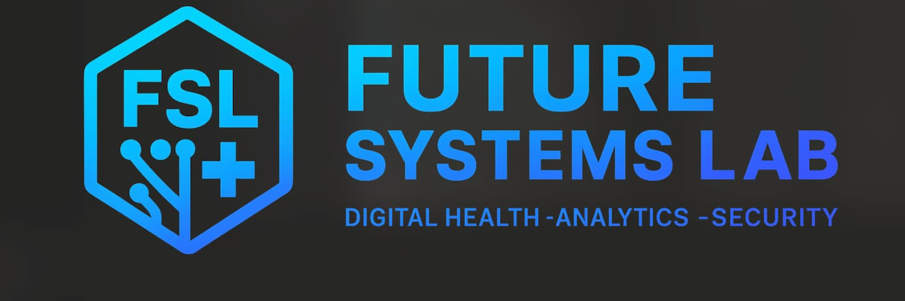

<!-- Rights Reserved, Unlicensed -->

  

---

  
  
  
  

---

## About Future Systems Lab

I design and deploy decentralized infrastructure for sovereign data governance — using regulated behavioral health as a deliberate proving ground for architectures that scale across complex domains.

As a long-term healthcare practitioner with experience operating HIPAA-compliant practice, I built within compliance frameworks before architecting beyond them. As founder of Future Systems Lab, I move from concept to production: on-chain deployments, EIP-191 wallet-gated consent architecture, and infrastructure designed to operate outside HIPAA scope by holding no PHI — a stronger architectural position than compliance, because the regulation doesn't apply when the system never holds the protected data.

**Nine Ethereum smart contracts deployed and verified on Sepolia. Every FSL system is in production.**

**[Academic Reviewer Evidence Portfolio](https://fsl-command-center.vercel.app/reviewer.html)** | **[Full CV](https://future-systems-lab.github.io/Future-Systems-Lab-profile/CV_MegMontanezDavenport.html)**

---

## Key Repositories

| Repository | Description |
|---|---|
| **[fsl-governance](https://github.com/Future-Systems-Lab/fsl-governance)** | Governance artifacts, specs, audits, contract source, council decisions |
| **[alchemist-forge](https://github.com/Future-Systems-Lab/alchemist-forge)** | Behavioral smart contract — Jungian shadow integration on-chain |
| **[fsl-command-center](https://github.com/Future-Systems-Lab/fsl-command-center)** | Wallet-gated admin dashboard + public reviewer surface |
| **[HypnoNeuro](https://github.com/Future-Systems-Lab/HypnoNeuro)** | 45 therapeutic games across 3 progressive levels |
| **[EncryptHealth](https://github.com/Future-Systems-Lab/EncryptHealth)** | Wallet-gated consent architecture, participant data sovereignty |
| **[SovereignLedger](https://github.com/Future-Systems-Lab/SovereignLedger)** | Session attestation — immutable proof of sessions between consenting wallets |
| **[mental-health-on-chain](https://github.com/Future-Systems-Lab/mental-health-on-chain)** | Public smart contract awareness series — case study documentation |
| **[open-source-portfolio](https://github.com/Future-Systems-Lab/open-source-portfolio)** | 8 OSS PRs to DIF, OpenZeppelin, Ethereum/EIPs, Hyperledger, Uniswap, Balancer |

---

## Six-Layer Architecture

| Layer | Component | Status |
|---|---|---|
| **Financial** | XRPL payment settlement + HNT/EHT governance tokens | Live |
| **Identity** | EIP-191 wallet-gated authentication, Brave Wallet primary | Live |
| **Governance** | SovereignLedger session attestation, BenevolenceFund | Live |
| **Compliance** | Zero-PHI by design — regulation doesn't apply when system never holds protected data | Live |
| **Therapeutic** | 45 games, SovereignSession wallet-native video, AlchemistForge | Live |
| **Research** | DEng Applied Project for ASU (Oct 2026 priority deadline) | Active |

---

## Technical Stack

- **Blockchain / Web3:** Solidity, EVM, EIP-191, EIP-1193, ERC-20/721/1155, Brave Wallet, WalletConnect, XRPL, WebRTC, DID/VCs, IPFS, ZK Proofs
- **Decentralized Health Architecture:** Sovereign data governance, wallet-native consent, zero-PHI architecture, on-chain session attestation, cross-domain infrastructure
- **Security & Governance:** CNCF TAG-Security, policy-as-code, SSI/DID consent flows, CISA-aligned audit frameworks
- **Data & Analytics:** PostgreSQL 17, Python, Tableau, Streamlit
- **Infrastructure:** Cloudflare Tunnel, coturn (TURN), PM2, Vercel, systemd, SSH Ed25519

---

## Access & Repository Policy

Architecture diagrams and system internals are maintained in **private, invite-only repositories** to protect pre-commercial IP and security design.

**Access available to academic reviewers and partners upon request** — future.systems.lab@proton.me

---

*Sovereignty by Design* | future.systems.lab@proton.me | [LinkedIn](https://www.linkedin.com/in/meg-monta%C3%B1ez-davenport-680652226/)
